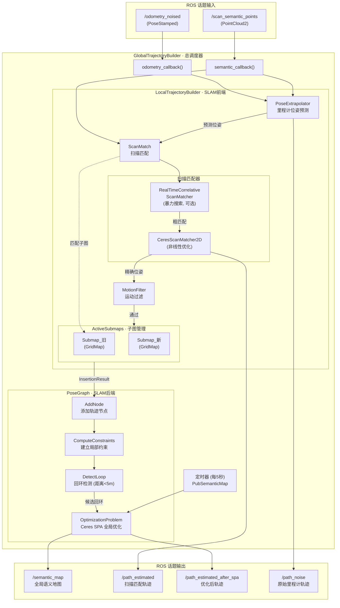
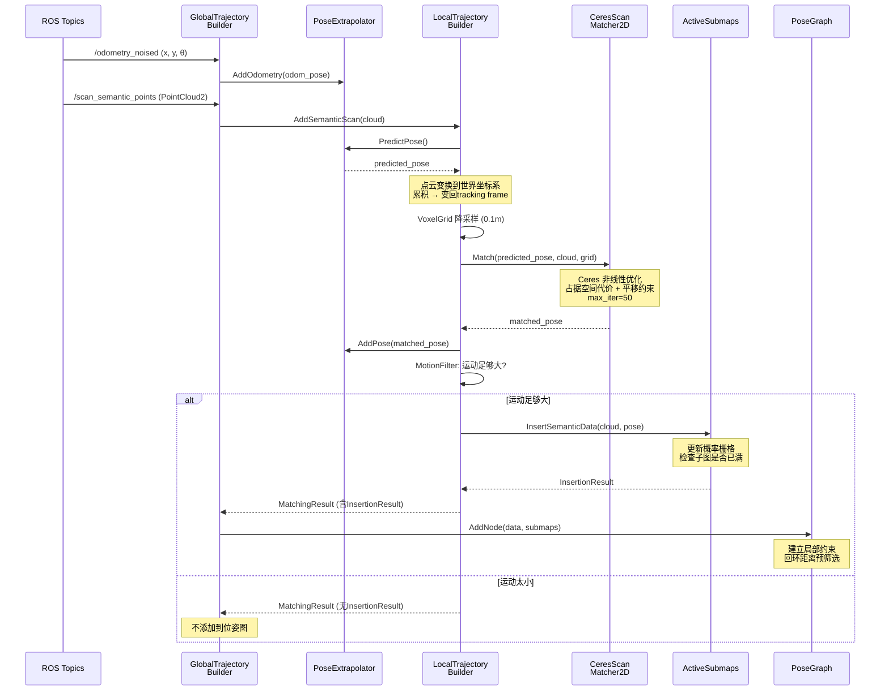
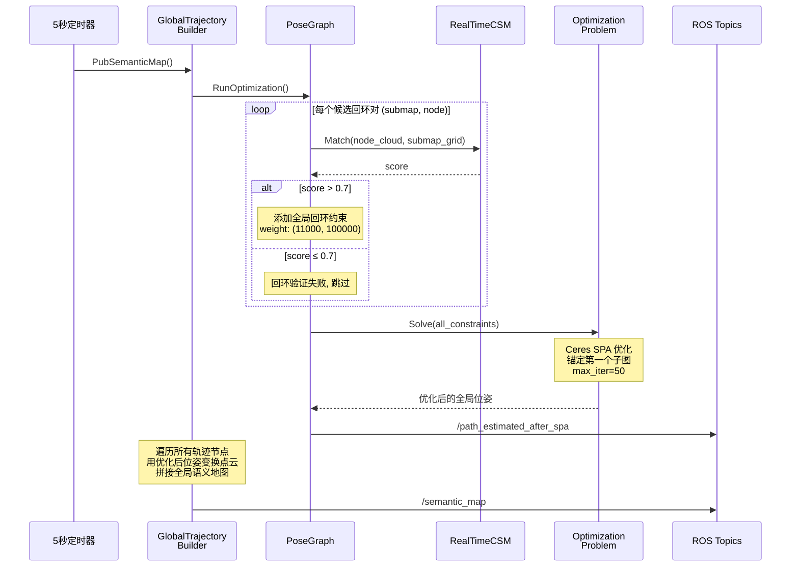

# AVP SLAM 系统架构总览

## 0. Mermaid 架构图与时序图

### 0.1 系统整体架构（Mermaid）



### 0.2 单帧数据处理时序图（Mermaid）



### 0.3 全局优化触发时序图（Mermaid）



## 1. 系统架构图（ASCII）

```
╔══════════════════════════════════════════════════════════════════════════════════╗
║                          AVP Semantic SLAM System                              ║
║                                                                                ║
║  ┌─────────────────────────────────────────────────────────────────────────┐    ║
║  │                    ROS 话题输入 (from Simulator / Bag)                  │    ║
║  │    /odometry_noised (PoseStamped)      /scan_semantic_points (PC2)     │    ║
║  └──────────┬───────────────────────────────────────┬──────────────────────┘    ║
║             │                                       │                          ║
║             ▼                                       ▼                          ║
║  ╔═══════════════════════════════════════════════════════════════════╗          ║
║  ║              GlobalTrajectoryBuilder (总调度器)                   ║          ║
║  ║                                                                   ║          ║
║  ║   odometry_callback()              semantic_callback()            ║          ║
║  ║         │                                │                        ║          ║
║  ║         │  AddSensorData(odom)           │  AddSensorData(scan)   ║          ║
║  ║         │                                │                        ║          ║
║  ║         ▼                                ▼                        ║          ║
║  ║  ┌─────────────────────────────────────────────────────┐          ║          ║
║  ║  │         LocalTrajectoryBuilder (SLAM 前端)          │          ║          ║
║  ║  │                                                     │          ║          ║
║  ║  │  ┌──────────────┐    ┌─────────────────────────┐   │          ║          ║
║  ║  │  │PoseExtrapolator│   │     ScanMatch           │   │          ║          ║
║  ║  │  │              │    │  ┌──────────────────┐   │   │          ║          ║
║  ║  │  │ AddOdometry()│    │  │RealTimeCorrelative│   │   │          ║          ║
║  ║  │  │ PredictPose()│    │  │  ScanMatcher     │   │   │          ║          ║
║  ║  │  │              │    │  │  (可选,暴力搜索)  │   │   │          ║          ║
║  ║  │  └──────────────┘    │  └──────────────────┘   │   │          ║          ║
║  ║  │                      │  ┌──────────────────┐   │   │          ║          ║
║  ║  │  ┌──────────────┐    │  │CeresScanMatcher2D│   │   │          ║          ║
║  ║  │  │MotionFilter  │    │  │  (非线性优化)     │   │   │          ║          ║
║  ║  │  │ IsSimilar()  │    │  └──────────────────┘   │   │          ║          ║
║  ║  │  └──────────────┘    └─────────────────────────┘   │          ║          ║
║  ║  │                                                     │          ║          ║
║  ║  │  ┌─────────────────────────────────────────────┐   │          ║          ║
║  ║  │  │            ActiveSubmaps                     │   │          ║          ║
║  ║  │  │  ┌─────────┐  ┌─────────┐                  │   │          ║          ║
║  ║  │  │  │Submap(旧)│  │Submap(新)│                  │   │          ║          ║
║  ║  │  │  │ GridMap  │  │ GridMap  │                  │   │          ║          ║
║  ║  │  │  └─────────┘  └─────────┘                  │   │          ║          ║
║  ║  │  └─────────────────────────────────────────────┘   │          ║          ║
║  ║  └───────────────────────────┬─────────────────────────┘          ║          ║
║  ║                              │ InsertionResult                    ║          ║
║  ║                              │ (constant_data + submaps)          ║          ║
║  ║                              ▼                                    ║          ║
║  ║  ┌───────────────────────────────────────────────────────┐        ║          ║
║  ║  │              PoseGraph (SLAM 后端)                     │        ║          ║
║  ║  │                                                        │        ║          ║
║  ║  │  ┌──────────────────────────────────────────────────┐ │        ║          ║
║  ║  │  │            约束管理                               │ │        ║          ║
║  ║  │  │  局部约束 (Non_Global)  +  全局约束 (Global)      │ │        ║          ║
║  ║  │  │  weight: (500, 1600)       weight: (11000, 1e5)  │ │        ║          ║
║  ║  │  └──────────────────────────────────────────────────┘ │        ║          ║
║  ║  │                                                        │        ║          ║
║  ║  │  ┌─────────────────┐  ┌──────────────────────────┐   │        ║          ║
║  ║  │  │  回环检测        │  │  OptimizationProblem     │   │        ║          ║
║  ║  │  │  DetectLoop()   │  │  (Ceres SPA 优化)        │   │        ║          ║
║  ║  │  │  距离<5m预筛选   │  │  Solve(constraints)      │   │        ║          ║
║  ║  │  │  score>0.7验证  │  │  max_iter=50             │   │        ║          ║
║  ║  │  └─────────────────┘  └──────────────────────────┘   │        ║          ║
║  ║  └────────────────────────────────────────────────────────┘        ║          ║
║  ║                              │                                     ║          ║
║  ║         PubSemanticMap()     │  每 5 秒定时触发                     ║          ║
║  ║              │               │                                     ║          ║
║  ╚══════════════╪═══════════════╪═════════════════════════════════════╝          ║
║                 │               │                                                ║
║                 ▼               ▼                                                ║
║  ┌─────────────────────────────────────────────────────────────────────────┐      ║
║  │                         ROS 话题输出                                    │      ║
║  │                                                                         │      ║
║  │  /semantic_map              全局语义地图（绿色点云）                      │      ║
║  │  /path_estimated            扫描匹配后的轨迹                             │      ║
║  │  /path_estimated_after_spa  全局优化后的轨迹                             │      ║
║  │  /path_noise                原始里程计轨迹                               │      ║
║  │  /accumulated_semantic_scan 当前帧累积点云                               │      ║
║  └─────────────────────────────────────────────────────────────────────────┘      ║
╚══════════════════════════════════════════════════════════════════════════════════╝
```

## 2. 完整数据流图

```
            ┌──────────────────── 输入数据 ────────────────────┐
            │                                                  │
            ▼                                                  ▼
    /odometry_noised                                /scan_semantic_points
    (x, y, yaw)                                     (语义点云: 车位线, 箭头)
            │                                                  │
            │ odometry_callback                                │ semantic_callback
            │                                                  │
            ▼                                                  ▼
    ┌───────────────┐                                ┌──────────────────┐
    │ Eigen::Vector3d│                               │ pcl::PointCloud  │
    │ (x, y, θ)     │                                │ <PointXYZ>       │
    └───────┬───────┘                                └────────┬─────────┘
            │                                                  │
            ▼                                                  ▼
   AddSensorData(odom)                              AddSensorData(scan)
            │                                                  │
            ▼                                                  ▼
┌───────────────────────┐                    ┌──────────────────────────────┐
│   PoseExtrapolator    │                    │  AddSemanticScan()           │
│                       │ PredictPose()      │                              │
│ odom_queue += odom    ├───────────────────►│  1. predict = Extrapolator   │
│                       │                    │     .PredictPose()           │
│                       │                    │                              │
│                       │                    │  2. scan → 世界坐标系         │
│                       │                    │     TransformPointCloud      │
│                       │                    │     (scan, predict_pose)     │
│                       │                    │                              │
│                       │                    │  3. 累积 accumulated_data    │
│                       │                    │                              │
│                       │                    │  4. 变回 tracking frame      │
│                       │                    │     T_vehicle_w × cloud      │
│                       │                    └────────────┬─────────────────┘
│                       │                                 │
│                       │                                 ▼
│                       │                    ┌──────────────────────────────┐
│                       │                    │  AddAccumulatedSemantics()   │
│                       │                    │                              │
│                       │                    │  5. VoxelGrid 降采样 0.1m    │
│                       │                    │                              │
│                       │                    │  6. ScanMatch()              │
│                       │                    │     ┌──────────────────┐     │
│                       │                    │     │ [可选] 暴力搜索   │     │
│                       │                    │     │ ±5m, ±30°       │     │
│                       │                    │     └────────┬─────────┘     │
│                       │                    │              ▼               │
│                       │                    │     ┌──────────────────┐     │
│                       │                    │     │ Ceres 优化匹配   │     │
│                       │                    │     │ 占据空间代价     │     │
│                       │                    │     │ + 平移约束       │     │
│                       │                    │     └────────┬─────────┘     │
│                       │◄─── AddPose() ─────┤              │               │
│                       │                    │     matched_pose             │
└───────────────────────┘                    │              │               │
                                             │  7. InsertIntoSubmap()       │
                                             │     ┌──────────────────┐     │
                                             │     │ MotionFilter     │     │
                                             │     │ 平移<0.2m? 跳过  │     │
                                             │     └────────┬─────────┘     │
                                             │              │               │
                                             │     ┌──────────────────┐     │
                                             │     │ ActiveSubmaps    │     │
                                             │     │ .InsertSemantic  │     │
                                             │     │  Data()          │     │
                                             │     └────────┬─────────┘     │
                                             └──────────────┼───────────────┘
                                                            │
                                                  InsertionResult
                                                  (点云 + 位姿 + 子图)
                                                            │
                                                            ▼
                                             ┌──────────────────────────────┐
                                             │      PoseGraph::AddNode()   │
                                             │                              │
                                             │  8. 计算全局位姿              │
                                             │  9. 建立局部约束              │
                                             │  10. 回环检测（距离预筛选）    │
                                             └──────────────┬───────────────┘
                                                            │
                                            ┌───────────────┴─────────────────┐
                                            │      每 5 秒                     │
                                            ▼                                  │
                                 ┌────────────────────┐                        │
                                 │ RunOptimization()  │                        │
                                 │                    │                        │
                                 │ 11. 回环扫描匹配    │                        │
                                 │     验证(score>0.7)│                        │
                                 │                    │                        │
                                 │ 12. SPA 全局优化    │                        │
                                 │     Ceres Solve    │                        │
                                 │                    │                        │
                                 │ 13. 更新所有节点    │                        │
                                 │     的全局位姿      │                        │
                                 └────────┬───────────┘                        │
                                          │                                    │
                                          ▼                                    │
                                 ┌────────────────────┐                        │
                                 │ PubSemanticMap()    │◄──────────────────────┘
                                 │                    │
                                 │ 14. 遍历所有节点    │
                                 │ 15. 用全局位姿      │
                                 │     变换点云        │
                                 │ 16. 发布地图        │
                                 └────────┬───────────┘
                                          │
                          ┌───────────────┼────────────────────┐
                          ▼               ▼                    ▼
                  /semantic_map   /path_estimated   /path_estimated_after_spa
```

## 3. 模块依赖关系

```
                        mapping_node_main.cc
                               │
                    ┌──────────┴──────────┐
                    ▼                     ▼
          GlobalTrajectoryBuilder    PoseGraph
                    │                     │
                    ▼                     ├─────────────────┐
          LocalTrajectoryBuilder          │                 │
                    │                     ▼                 ▼
        ┌───────────┼───────────┐   Constraint     OptimizationProblem
        │           │           │        │                 │
        ▼           ▼           ▼        ▼                 ▼
PoseExtrapolator  ScanMatch   ActiveSubmaps         SpaCostFunction2D
                    │           │
        ┌───────────┤           ▼
        │           │         Submap
        ▼           │           │
RealTimeCSM    CeresScanMatcher │
        │           │           ▼
        │           │        GridMap
        │           │           │
        ▼           ▼           ▼
 CorrelativeScanMatcher   ProbabilityGridRangeDataInserter
                                │
                                ▼
                     ValueConversionTables
                     ProbabilityValues
```

## 4. 文件与模块对照表

```
src/
├── mapping_node_main.cc              ← 入口：创建3个核心对象，启动ros::spin
│
├── mapping/                          ← SLAM 核心模块
│   ├── global_trajectory_builder     ← 总调度：订阅话题，分发数据
│   ├── local_trajectory_builder      ← 前端：位姿预测 + 扫描匹配 + 子图插入
│   │
│   ├── pose_extrapolator             ← 位姿预测：里程计增量外推
│   ├── motion_filter                 ← 运动过滤：跳过微小移动
│   ├── transform                     ← 坐标变换：2D齐次变换
│   ├── trajectory_node               ← 数据结构：轨迹节点
│   │
│   ├── real_time_correlative_scan_matcher  ← 扫描匹配（暴力搜索）
│   ├── correlative_scan_matcher           ← 搜索空间/候选解/离散化
│   ├── ceres_scan_matcher_2d              ← 扫描匹配（Ceres优化）
│   ├── occupied_space_cost_function       ← Ceres代价：占据空间
│   ├── translation_delta_cost_functor_2d  ← Ceres代价：平移约束
│   ├── rotation_delta_cost_functor_2d     ← Ceres代价：旋转约束
│   │
│   ├── pose_graph                    ← 后端：节点管理 + 回环检测
│   ├── constraint                    ← 约束定义 + 相对位姿计算
│   ├── optimization_problem          ← SPA全局优化
│   ├── spa_cost_function             ← SPA代价函数
│   └── io                           ← 栅格地图可视化工具
│
└── GridMap/                          ← 地图数据结构
    ├── gridmap                       ← 2D概率栅格地图
    ├── submap                        ← 子图 + ActiveSubmaps管理
    ├── probability_grid_range_data_inserter  ← 点云→栅格插入
    ├── probability_values            ← 概率/代价转换
    ├── value_conversion_tables       ← 查找表预计算
    ├── port                          ← 工具类型定义
    └── math                          ← 数学工具函数
```

## 5. 坐标系关系

```
本系统涉及 3 个坐标系:

    世界坐标系 (world frame)
    ┌────────────────────────────────────────┐
    │                                        │
    │   ┌────────────────────┐               │
    │   │ 子图坐标系          │               │
    │   │ (submap frame)     │               │
    │   │                    │               │
    │   │  T_world_submap    │               │
    │   │  = submap.local_   │               │
    │   │    pose()          │               │
    │   └────────────────────┘               │
    │                                        │
    │            ╔═══════╗                   │
    │            ║ 车辆  ║ ← tracking frame  │
    │            ║       ║   (vehicle frame) │
    │            ╚═══════╝                   │
    │            T_world_vehicle             │
    │            = node.global_pose          │
    └────────────────────────────────────────┘

    变换关系:
    ┌─────────────────────────────────────────────────┐
    │ 世界坐标系 ←─ T_world_vehicle ──── 车辆坐标系   │
    │     ▲                                           │
    │     │                                           │
    │  T_world_submap                                 │
    │     │                                           │
    │ 子图坐标系                                       │
    │                                                  │
    │ T_global_local = T_world_submap × T_local_submap⁻¹│
    │                                                  │
    │ 约束中的 relative_pose:                           │
    │   T_submap⁻¹ × T_node = 节点在子图坐标系下的位姿  │
    └─────────────────────────────────────────────────┘

    语义点云的坐标变换链:
    ┌────────────┐    TransformPointCloud     ┌────────────┐
    │ 车辆坐标系  │ ──────(predict_pose)──────► │ 世界坐标系  │
    │ (scan原始)  │                            │ (累积/显示)  │
    └────────────┘                             └────────────┘
         ▲                                          │
         │              T_vehicle_world⁻¹           │
         └──────────────────────────────────────────┘
         变回tracking frame, 用于扫描匹配
```

## 6. 处理时序（单帧数据的完整生命周期）

```
时间    组件                        操作                           耗时
─────┬─────────────────────────┬──────────────────────────────┬────────
 t0  │ ROS                     │ 收到 /odometry_noised        │ ~0ms
     │ GlobalTrajectoryBuilder │ → AddSensorData(odom)        │
     │ PoseExtrapolator        │ → AddOdometry(odom)          │
─────┤                         │                              │
 t1  │ ROS                     │ 收到 /scan_semantic_points   │ ~0ms
     │ GlobalTrajectoryBuilder │ → AddSensorData(scan)        │
─────┤                         │                              │
 t2  │ LocalTrajectoryBuilder  │ AddSemanticScan():           │
     │ PoseExtrapolator        │   PredictPose()              │ ~0.1ms
     │                         │   TransformPointCloud → 世界系│ ~0.5ms
     │                         │   累积 + 着色 + 发布          │ ~1ms
     │                         │   变回 tracking frame         │ ~0.5ms
─────┤                         │                              │
 t3  │ LocalTrajectoryBuilder  │ AddAccumulatedSemantics():   │
     │                         │   VoxelGrid 降采样            │ ~1ms
─────┤                         │                              │
 t4  │ CeresScanMatcher2D      │ ScanMatch():                 │
     │                         │   Ceres Solve (50 iter)       │ ~5-20ms
     │ PoseExtrapolator        │   AddPose(matched_pose)       │ ~0ms
─────┤                         │                              │
 t5  │ MotionFilter            │ InsertIntoSubmap():           │
     │                         │   IsSimilar() → 通过          │ ~0ms
     │ ActiveSubmaps           │   InsertSemanticData()         │ ~1-2ms
     │ ProbabilityGridInserter │   更新栅格概率                  │
─────┤                         │                              │
 t6  │ PoseGraph               │ AddNode():                    │
     │                         │   计算全局位姿                  │ ~0.1ms
     │                         │   建立局部约束                  │ ~0.1ms
     │                         │   回环距离预筛选                │ ~0.5ms
─────┤                         │                              │
     │ 单帧总耗时               │                              │ ~10-25ms
═════╪═════════════════════════╪══════════════════════════════╪════════
 每5s│ PoseGraph               │ RunOptimization():            │
     │ RealTimeCSM             │   回环扫描匹配验证              │ ~10-50ms
     │ OptimizationProblem     │   Ceres SPA Solve             │ ~5-20ms
     │ GlobalTrajectoryBuilder │   PubSemanticMap()             │ ~5-10ms
     │                         │                              │
     │ 优化总耗时               │                              │ ~20-80ms
─────┴─────────────────────────┴──────────────────────────────┴────────
```
