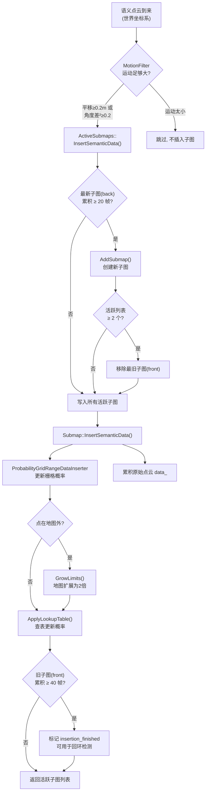
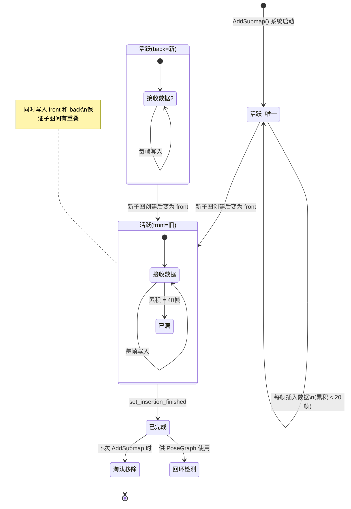
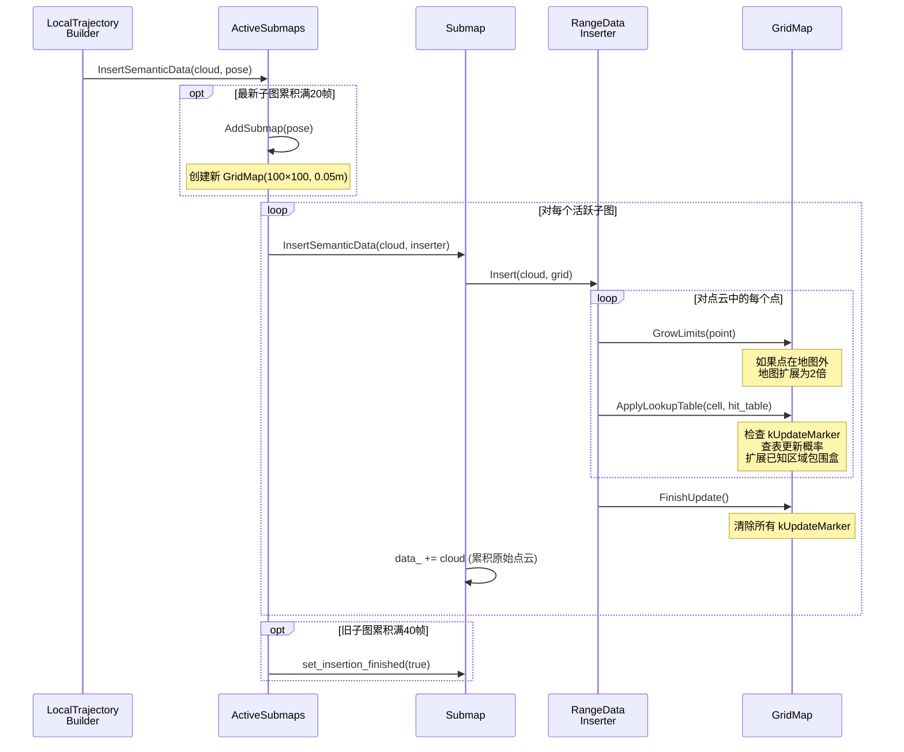

# 建图模块详解

## 0. Mermaid 流程图与时序图

### 0.1 建图整体流程



### 0.2 子图生命周期状态图



### 0.3 概率更新时序图



## 1. 概述

建图（Mapping）是指将传感器采集到的语义点云数据逐帧融合到栅格地图中，构建出停车场环境的语义地图。本系统的建图模块参考 Cartographer 的子图（Submap）设计，采用**概率栅格地图 + 滑动窗口子图管理**的架构。

**涉及的核心类：**
- `ActiveSubmaps` — 管理活跃子图（1~2个）
- `Submap` — 单个子图，包含概率栅格 `GridMap` 和累积的语义点云
- `GridMap` — 2D 概率栅格地图，存储每个格子的占据概率
- `ProbabilityGridRangeDataInserter` — 将语义点云写入栅格的插入器

## 2. 算法流程

### 2.1 数据入口

每当 `LocalTrajectoryBuilder::InsertIntoSubmap()` 被调用时（前提是通过了 `MotionFilter` 过滤），建图流程启动：

```
LocalTrajectoryBuilder::InsertIntoSubmap()
    │
    ├── MotionFilter::IsSimilar()  → 运动太小？跳过
    │
    └── ActiveSubmaps::InsertSemanticData(world_cloud, pose)
            │
            ├── 判断是否需要创建新子图
            ├── 将点云插入所有活跃子图
            └── 检查旧子图是否已满
```

### 2.2 子图生命周期

```
关键参数: max_semantic_data_in_submap = 20

                  创建              数据写入完毕          从活跃列表移除
                   │                    │                    │
    ┌──────────────┼────────────────────┼────────────────────┼──────────
    │  Submap_0    │◄── 累积1~40帧 ──►│ insertion_finished  │ 被淘汰
    ┌──────────────┼─────────┬──────────┼────────────────────┼──────────
    │  Submap_1              │◄─ 累积1~40帧 ──►│           │
    ┌──────────────┼─────────┼──────────┼─────────┬──────────┼──────────
    │  Submap_2                                   │◄─ ...
    ─────────────────────────────────────────────────────────────────►
                                                              时间
```

**详细状态转换：**

1. **创建条件**：活跃子图列表为空，或最新子图（back）累积了 20 帧数据
2. **同时写入**：每帧语义数据会写入**所有**活跃子图（1~2个），保证子图间有重叠
3. **完成标记**：旧子图（front）累积满 40 帧后标记 `insertion_finished = true`
4. **淘汰条件**：当需要创建新子图且活跃列表已有 2 个时，移除最旧的

**重叠设计的意义：**

每个子图包含 40 帧数据，相邻子图有 20 帧重叠。这保证了：
- 子图之间有连续性，不会出现"断层"
- 已完成的子图包含足够多的数据，回环检测时匹配质量更高

### 2.3 栅格地图数据结构

```
GridMap 内部结构:

┌─────────────────────────────────────────┐
│  MapLimits                              │
│  ├── resolution = 0.05m（每格5cm）       │
│  ├── max_ = 右上角世界坐标               │
│  └── CellLimits = 初始 100×100 格       │
├─────────────────────────────────────────┤
│  correspondence_cost_cells_（uint16数组）│
│  ├── 每个格子用 uint16 存储空闲代价      │
│  ├── 值越大 → 越可能空闲                 │
│  ├── 值越小 → 越可能被占据               │
│  └── 初始值 = kUnknownCorrespondenceValue│
├─────────────────────────────────────────┤
│  value_to_correspondence_cost_table_    │
│  └── uint16 → float 查找表             │
└─────────────────────────────────────────┘

坐标转换关系:
  世界坐标 (x,y)
      │
      ▼ GetCellIndex()
  栅格索引 (row, col)  ← row由y坐标决定，col由x坐标决定
      │
      ▼ ToFlatIndex()
  一维数组索引 = num_x_cells × col + row
```

### 2.4 概率更新机制

语义点云插入栅格的过程，本质是**贝叶斯概率更新**的查表加速版本：

```
ProbabilityGridRangeDataInserter::Insert(point_cloud, grid)
    │
    ├── 对每个点:
    │     ├── grid->GrowLimits(point)   // 必要时扩展地图
    │     └── grid->ApplyLookupTable(cell_index, hit_table)
    │           │
    │           ├── flat_index = ToFlatIndex(cell_index)
    │           ├── 检查 kUpdateMarker（防止同帧重复更新）
    │           └── cell = hit_table[cell]  // 查表更新概率
    │
    └── grid->FinishUpdate()  // 清除 kUpdateMarker 标记
```

**查找表原理：**

传统贝叶斯更新：`P_new = P_old × P_hit / (P_old × P_hit + (1-P_old) × (1-P_hit))`

这个计算每次都需要浮点除法。Cartographer 将所有可能的 `P_old` 离散化为 uint16，预计算 `hit_table[P_old] = P_new`，实现 O(1) 查表更新。

**kUpdateMarker 机制：**

每个格子在一轮更新中只能被修改一次。通过在值上加一个大数（kUpdateMarker）标记"已更新"，本帧内再次访问时跳过。`FinishUpdate()` 减去标记恢复正常。

### 2.5 地图动态扩展

初始栅格大小为 100×100 格（覆盖 5m×5m，origin 位于中心即 ±2.5m），当点落在地图外时自动扩展：

```
GrowLimits(point):
    while point 不在地图范围内:
        1. 新地图大小 = 2倍（x/y 各翻倍）
        2. 中心不变，向四周扩展
        3. 新格子初始化为 unknown
        4. 旧数据复制到新地图对应位置
        5. 更新 MapLimits
```

极端情况下可能连续扩展多次，直到点被包含在内。

## 3. 建图结果输出

全局语义地图每 5 秒发布一次（`GlobalTrajectoryBuilder::PubSemanticMap`）：

```
PubSemanticMap():
    1. RunOptimization()  // 先执行全局优化（见回环文档）
    2. 获取所有轨迹节点（含优化后的全局位姿）
    3. 遍历每个节点:
        a. 取其 filtered_semantic_data（tracking frame下的点云）
        b. 用优化后的 global_pose 变换到世界坐标系
        c. 着色为绿色，累加到全局点云
    4. 发布到 /semantic_map 话题
    5. [新增] 保存 semantic_map_latest.pcd（若 save_map_each_optimization=true）
```

### 3.1 文件日志（SlamFileLogger）

`mapping_node` 启动时通过 `SlamFileLogger` 将建图全过程写入 `output/logs/mapping_slam.log`，同时镜像到 ROS 终端。主要记录：

- **前端**：`SCAN_MATCH`（预测位姿 vs 匹配位姿）、`INSERT`（子图插入/运动过滤）
- **后端**：`NODE`（节点加入）、`LOOP`（候选/接受/拒绝及 score）、`SPA`（Ceres 代价与迭代）
- **调度**：`OPTIMIZE`（每 5 秒定时触发）、`MAP_PUB`、`MAP_SAVE`

日志行格式：`时间戳 [分类] 消息`，时间戳为 `ros::Time::now().toSec()`。

### 3.2 地图 PCD 保存

| 时机 | 文件 | 触发条件 |
|------|------|----------|
| 每次 SPA 后 | `output/semantic_map_latest.pcd` | `save_map_each_optimization=true` |
| 节点退出 | `output/semantic_map_final.pcd` | `save_map_on_shutdown=true` 且已构建过地图 |

点云为 RGB 格式（绿色语义点），坐标系 `world`，与 `/semantic_map` 话题内容一致（未体素滤波的累积点云）。

参数在 `launch/mapping.launch` 的 `mapping` 节点私有命名空间中配置，详见根目录 `README.md` 第 5 节。

## 4. 关键参数一览

| 参数 | 值 | 位置 | 含义 |
|------|-----|------|------|
| `max_semantic_data_in_submap` | 20 | `submap.h` | 触发新子图创建的帧数阈值 |
| `resolution` | 0.05m | `submap.cc:CreateGrid` | 栅格分辨率 |
| `kInitialSubmapSize` | 100 | `submap.cc:CreateGrid` | 初始栅格大小（格数） |
| `min_correspondence_cost_` | 0.1 | `gridmap.h` | 最小空闲代价 |
| `max_correspondence_cost_` | 0.9 | `gridmap.h` | 最大空闲代价 |
| 体素滤波 `LeafSize` | 0.1m | `local_trajectory_builder.cc` | 点云降采样尺度 |
| MotionFilter 平移阈值 | 0.2m | `motion_filter.cc` | 低于此值跳过插入 |
| MotionFilter 旋转阈值 | √0.2 ≈ 0.45rad | `motion_filter.cc` | 角度差的平方阈值 |
