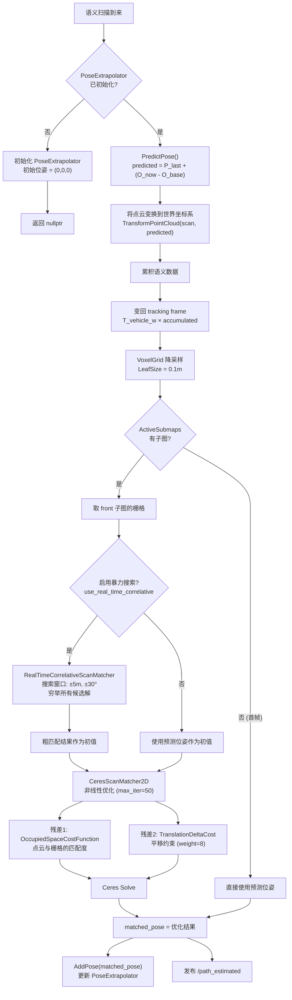
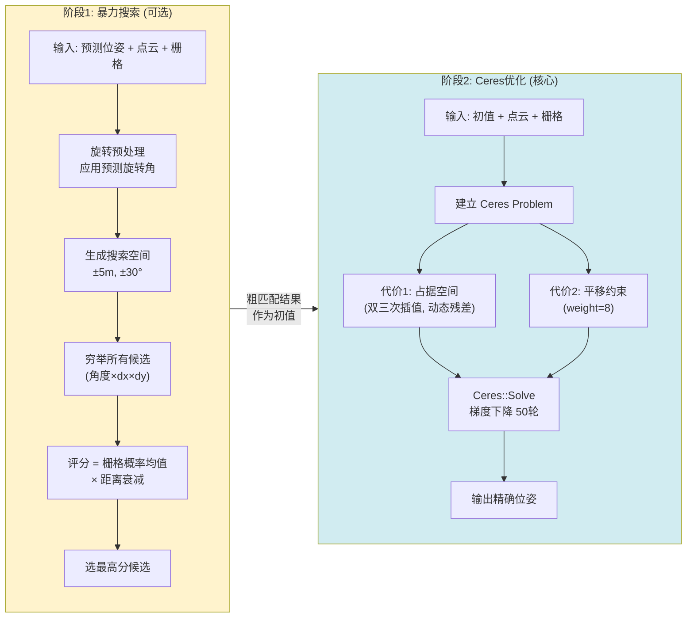
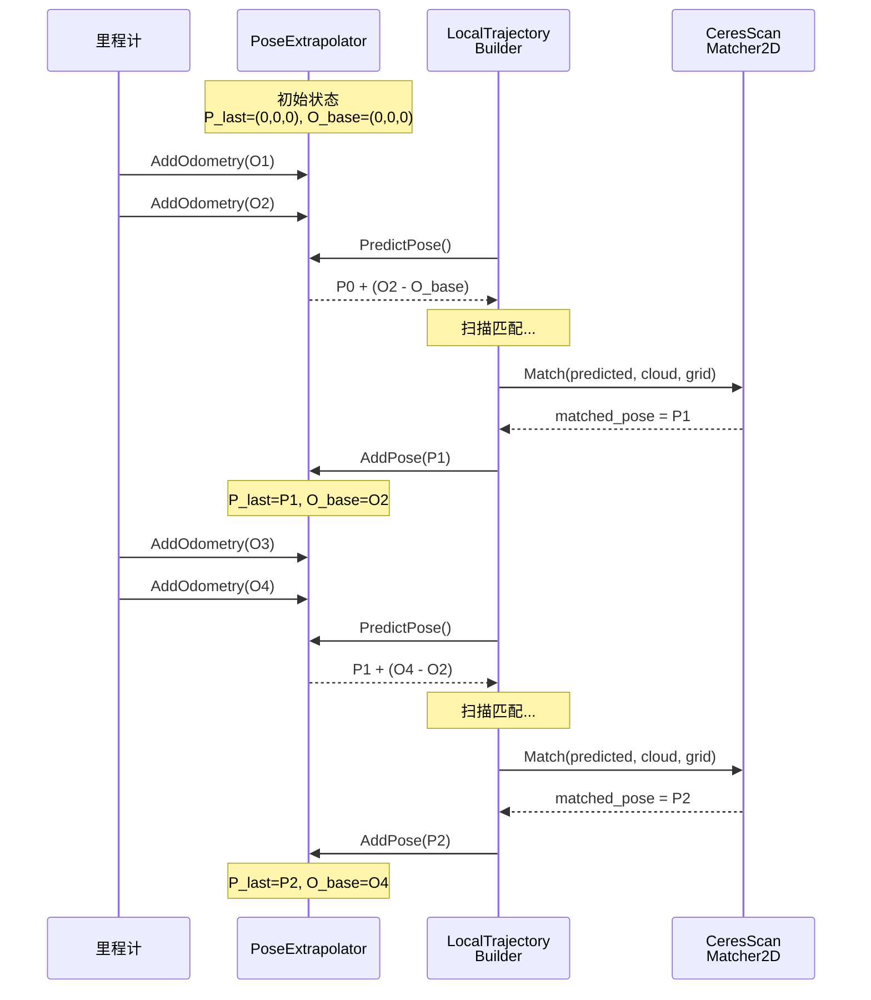

# 定位模块详解

## 0. Mermaid 流程图与时序图

### 0.1 定位整体流程



### 0.2 扫描匹配两阶段对比



### 0.3 位姿预测时序图



## 1. 概述

定位（Localization）是指在已有地图（子图栅格）的基础上，确定当前车辆的精确位姿 (x, y, θ)。本系统采用**里程计预测 + 扫描匹配校正**的两步策略，参考 Cartographer 的前端设计。

**涉及的核心类：**
- `PoseExtrapolator` — 利用里程计增量预测位姿
- `RealTimeCorrelativeScanMatcher` — 暴力穷举扫描匹配（可选）
- `CeresScanMatcher2D` — 基于 Ceres 非线性优化的精细匹配
- `OccupiedSpaceCostFunction2D` — Ceres 的占据空间代价函数

## 2. 算法流程

### 2.1 总体流程

```
每帧语义点云到来:

  ┌──────────────────────────┐
  │ 1. 位姿预测（里程计外推）  │
  │    PoseExtrapolator       │
  │    predicted = P_last     │
  │       + (O_now - O_last)  │
  └────────────┬─────────────┘
               │
               ▼
  ┌──────────────────────────┐
  │ 2. 点云累积与坐标变换     │
  │    scan → 世界坐标系      │
  │    → 累积                 │
  │    → 变回 tracking frame  │
  └────────────┬─────────────┘
               │
               ▼
  ┌──────────────────────────┐
  │ 3. 体素滤波降采样         │
  │    VoxelGrid 0.1m        │
  └────────────┬─────────────┘
               │
               ▼
  ┌──────────────────────────────────────────┐
  │ 4. 扫描匹配（两阶段）                     │
  │                                          │
  │   4a. [可选] 实时相关扫描匹配              │
  │       暴力搜索 ±5m, ±30°                  │
  │       → 粗匹配结果                        │
  │                                          │
  │   4b. Ceres扫描匹配                       │
  │       非线性优化，梯度下降                  │
  │       → 精确匹配结果                      │
  └────────────┬─────────────────────────────┘
               │
               ▼
  ┌──────────────────────────┐
  │ 5. 更新 PoseExtrapolator  │
  │    AddPose(matched_pose)  │
  └──────────────────────────┘
```

### 2.2 位姿预测（PoseExtrapolator）

位姿预测器维护两个队列，利用里程计增量预测当前位姿：

```
PoseExtrapolator 内部状态:

  timed_pose_queue_:     [P0, P1, P2, ...]    ← 扫描匹配校正后的位姿
  odometry_pose_queue_:  [O0, O1, O2, ...]    ← 原始里程计数据
  last_odometry_pose_:   O_at_last_AddPose    ← 上次校正时的里程计值

预测公式:
  predicted_pose = timed_pose_queue_.back()
                 + (odometry_pose_queue_.back() - last_odometry_pose_)

即: 上次校正位姿 + 自那以后的里程计增量
```

**时序示意：**

```
时间    事件                        内部状态变化
────────────────────────────────────────────────────────
t0      AddPose(P0)                P_last=P0, O_base=O(t0)
t1      AddOdometry(O1)            odom_queue += O1
t2      AddOdometry(O2)            odom_queue += O2
t3      PredictPose()              → P0 + (O2 - O(t0))
t3      语义扫描到来 → 扫描匹配
t3      AddPose(P1)                P_last=P1, O_base=O2
t4      AddOdometry(O3)            odom_queue += O3
t5      PredictPose()              → P1 + (O3 - O2)
```

### 2.3 实时相关扫描匹配（可选）

这是一种暴力穷举搜索算法，在指定的搜索窗口内遍历所有可能的位姿偏移，找到与栅格地图最匹配的位姿。

**算法步骤：**

```
RealTimeCorrelativeScanMatcher::Match():

Step 1: 旋转预处理
    将 tracking frame 下的点云应用预测的旋转角度
    → 后续角度搜索以 0 为中心

Step 2: 构建搜索空间
    SearchParameters:
    ├── 线性搜索窗口: ±5m → ±100格（按 0.05m 分辨率）
    ├── 角度搜索窗口: ±π/6 ≈ ±30°
    ├── 角度步长: acos(1 - res²/(2×max_range²)) ≈ 极小值
    └── num_scans = 2×num_angular + 1

Step 3: 生成旋转点云集合
    对每个角度步长 δθ:
        rotated_scan[i] = Rotate(cloud, δθ_i)
    共 num_scans 个旋转副本

Step 4: 离散化
    对每个旋转点云:
        对每个点:
            栅格索引 = GetCellIndex(点 + 预测平移量)
    → discrete_scans[scan_index][point_index] = Array2i

Step 5: 穷举搜索
    对 (scan_index, dx, dy) 的所有组合:
        score = Σ probability(grid[点 + (dx,dy)]) / N
        score *= exp(-(|偏移|×0.1 + |角度|×0.1)²)
    
    → 选择 score 最高的候选解

Step 6: 输出
    pose_estimated = predict_pose + best_candidate.(x, y, θ)
```

**评分函数详解：**

```
最终得分 = 栅格匹配得分 × 距离衰减因子

栅格匹配得分 = 所有点在栅格上的占据概率均值（0~1）
    → 点落在已占据的区域 → 概率高 → 匹配好

距离衰减因子 = exp(-(√(dx²+dy²) × 0.1 + |dθ| × 0.1)²)
    → 偏离预测位姿越远 → 因子越小
    → 偏好小位移的解，避免"跳跃"到错误位置
```

**优缺点：**
- 优点：不依赖初值，全局搜索能力强，适合初始误差大的场景
- 缺点：计算量 = num_scans × (2×linear_range/res + 1)²，非常大
- 当前默认关闭（`use_real_time_correlative_scan_match = false`）

### 2.4 Ceres 扫描匹配（核心）

将扫描匹配建模为非线性最小二乘优化问题，利用 Ceres Solver 求解。

**问题建模：**

```
优化变量:
    pose = (x, y, θ)    ← 3个自由度

残差项:
    ┌─────────────────────────────────────────────────────────┐
    │ 残差1: OccupiedSpaceCostFunction2D（核心）               │
    │                                                         │
    │   对点云中的每个点 p_i:                                   │
    │     1. 按 pose 变换到世界坐标:                            │
    │        p_world = R(θ) × p_i + t(x,y)                   │
    │     2. 在栅格地图中查询空闲代价（双三次插值）:              │
    │        r_i = BiCubicInterpolate(grid, p_world)          │
    │     3. 残差 = scaling_factor × r_i                      │
    │                                                         │
    │   scaling_factor = 1/√N（归一化，与点云大小无关）          │
    │   残差维度 = N（点云大小，动态）                           │
    │                                                         │
    │   物理含义：                                              │
    │     空闲代价大 → 点落在空闲区域 → 残差大 → 不好           │
    │     空闲代价小 → 点落在占据区域 → 残差小 → 好             │
    │     优化目标：调整 pose 让点云尽量落在已占据的区域          │
    ├─────────────────────────────────────────────────────────┤
    │ 残差2: TranslationDeltaCostFunctor2D（约束）             │
    │                                                         │
    │   r = weight × (pose.xy - target_translation)           │
    │   weight = 8                                            │
    │   target = 预测的平移分量                                │
    │                                                         │
    │   物理含义：                                              │
    │     防止优化后的平移偏离预测值太远                         │
    │     起到正则化的作用                                      │
    ├─────────────────────────────────────────────────────────┤
    │ 残差3: RotationDeltaCostFunctor2D [已禁用]               │
    │                                                         │
    │   r = weight × (θ - θ_target)                           │
    │   如果启用，会约束旋转角度保持不变                         │
    └─────────────────────────────────────────────────────────┘

求解器配置:
    max_iterations = 50
    自动微分（AutoDiff）
```

**双三次插值的必要性：**

```
问题: 栅格地图是离散的，无法直接求梯度
     
     ┌───┬───┬───┐
     │0.2│0.3│0.8│     ← 离散的栅格值
     ├───┼───┼───┤        不可微
     │0.1│0.1│0.7│
     └───┴───┴───┘

解决: BiCubicInterpolator 对栅格值做双三次插值
      → 连续可微的代价函数
      → Ceres 可以用自动微分计算梯度

     ╭─────────────╮
     │  ~~平滑曲面~~ │     ← 插值后的连续值
     │  可求梯度     │        可以做梯度下降
     ╰─────────────╯

GridArrayAdapter:
    在地图边界外填充最大空闲代价（kPadding = INT_MAX/4）
    → 点飞出地图时残差很大，会被拉回来
```

### 2.5 匹配子图的选择

扫描匹配使用 `ActiveSubmaps` 中第一个子图（front）的栅格：

```cpp
std::shared_ptr<const Submap> matching_submap = active_submaps_.submaps().front();
```

**选择 front 而非 back 的原因：**
- front 是较旧的子图，包含更多数据，栅格信息更丰富
- back 是新创建的子图，数据量少，匹配可能不可靠
- 当只有一个子图时，front == back

## 3. 定位精度对比

系统同时发布三条轨迹用于对比：

| 话题 | 含义 | 精度 |
|------|------|------|
| `/path_noise` | 原始里程计轨迹 | 低（有累积漂移） |
| `/path_estimated` | 扫描匹配后的轨迹 | 中（局部精确） |
| `/path_estimated_after_spa` | 全局优化后的轨迹 | 高（消除漂移） |

## 4. 关键参数一览

| 参数 | 值 | 位置 | 含义 |
|------|-----|------|------|
| `use_real_time_correlative_scan_match` | false | `local_trajectory_builder.h` | 是否启用暴力搜索 |
| 线性搜索窗口 | 5m | `real_time_correlative_scan_matcher.cc` | 暴力搜索的平移范围 |
| 角度搜索窗口 | π/6 ≈ 30° | `real_time_correlative_scan_matcher.cc` | 暴力搜索的旋转范围 |
| Ceres 最大迭代次数 | 50 | `ceres_scan_matcher_2d.cc` | Ceres 优化迭代上限 |
| 平移约束权重 | 8 | `ceres_scan_matcher_2d.cc` | 防止平移偏离预测值 |
| 占据空间代价缩放 | 1/√N | `ceres_scan_matcher_2d.cc` | 归一化点云大小 |
| 距离衰减系数 | 0.1 | `real_time_correlative_scan_matcher.cc` | 暴力搜索的距离惩罚 |
