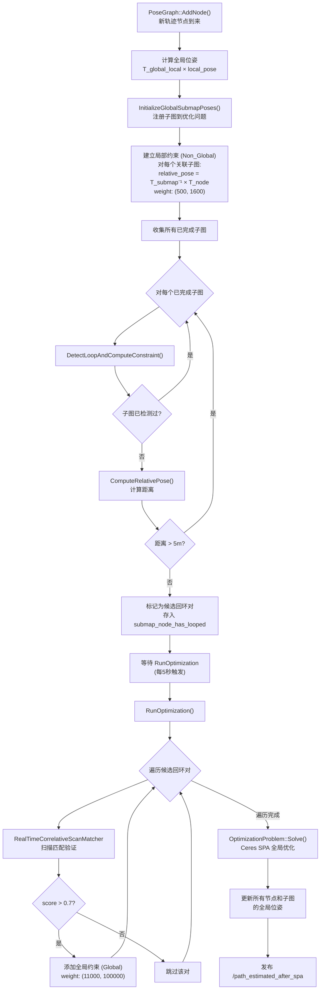
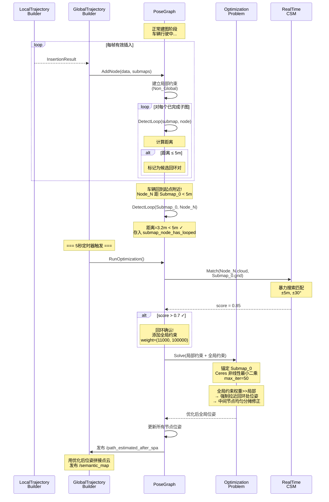
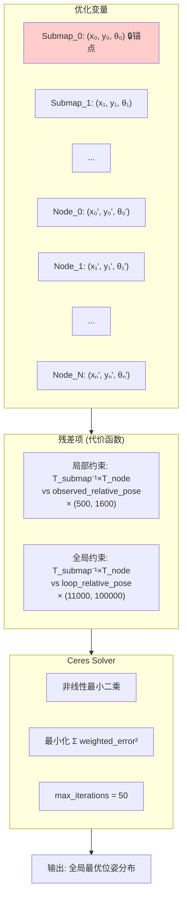

# 回环检测与全局优化详解

## 0. Mermaid 流程图与时序图

### 0.1 回环检测与优化整体流程



### 0.2 约束权重对比图

```mermaid
flowchart LR
    subgraph Local["局部约束 (Non_Global)"]
        direction TB
        L1["来源: 扫描匹配结果"]
        L2["连接: 节点 ↔ 所属子图"]
        L3["translation_weight: 500"]
        L4["rotation_weight: 1,600"]
        L5["数量: 每节点1~2个"]
    end

    subgraph Global["全局约束 (Global)"]
        direction TB
        G1["来源: 回环检测"]
        G2["连接: 节点 ↔ 远处子图"]
        G3["translation_weight: 11,000"]
        G4["rotation_weight: 100,000"]
        G5["数量: 仅回环处"]
    end

    Local -->|"权重比\n平移 1:22\n旋转 1:62"| Global

    style Local fill:#d4edda
    style Global fill:#f8d7da
```



### 0.3 回环检测完整时序图



### 0.4 SPA 优化过程



## 1. 概述

回环检测（Loop Closure）是 SLAM 后端的核心功能，用于识别车辆重新访问了之前到过的地方，并利用这一信息消除轨迹的累积漂移。本系统采用**距离预筛选 + 扫描匹配验证 + SPA 全局优化**的策略。

**涉及的核心类：**
- `PoseGraph` — 全局位姿图，维护所有节点、子图和约束
- `Constraint` — 子图-节点之间的约束（局部 + 全局）
- `OptimizationProblem` — 基于 Ceres 的 SPA 优化问题
- `SpaCostFunction2D` — SPA 约束的代价函数
- `RealTimeCorrelativeScanMatcher` — 回环验证时的扫描匹配

## 2. 位姿图的结构

### 2.1 核心数据

```
PoseGraphData:
    ├── trajectory_nodes     {id → TrajectoryNode}
    │     └── TrajectoryNode:
    │           ├── constant_data → (filtered_semantic_data, local_pose)
    │           └── global_pose   ← 优化后会被更新
    │
    ├── submap_data          {id → InternalSubmapData}
    │     └── InternalSubmapData:
    │           ├── submap → Submap*（含栅格地图）
    │           ├── state  → kNoConstraintSearch / kFinished
    │           └── node_ids → 属于该子图的节点集合
    │
    ├── constraints          [Constraint, ...]
    │     └── Constraint:
    │           ├── submap_id, node_id
    │           ├── relative_pose (dx, dy, dθ)  ← 子图坐标系下
    │           ├── translation_weight, rotation_weight
    │           └── tag: Non_Global / Global
    │
    └── global_submap_poses_2d  {id → SubmapSpec2D}
          └── 优化后的子图全局位姿
```

### 2.2 图的可视化

```
    Submap_0 ◄──(局部)── Node_0
        ▲                  │
        │                  │
    (局部)              (局部)
        │                  │
        │                  ▼
    Submap_1 ◄──(局部)── Node_1
        ▲                  │
        │                  │
    (局部)              (局部)
        │                  │
        │                  ▼
    Submap_2 ◄──(局部)── Node_2
                           │
                           :
                           │
                         Node_N
                           │
                       (全局回环)     ← 回环检测发现 Node_N 靠近 Submap_0
                           │
                           ▼
                       Submap_0      ← 添加全局约束，权重远大于局部约束
```

## 3. 算法流程

### 3.1 添加节点与约束

每当 `LocalTrajectoryBuilder` 产生一个 `InsertionResult`（即通过了运动过滤的有效帧），`PoseGraph::AddNode` 被调用：

```
PoseGraph::AddNode(constant_data, insertion_submaps):

  ┌─────────────────────────────────────────────────────┐
  │ 1. 计算全局位姿                                      │
  │    T_global_local = ComputeLocalToGlobalTransform()  │
  │    global_pose = T_global_local × local_pose         │
  │    → 添加到 trajectory_nodes                         │
  ├─────────────────────────────────────────────────────┤
  │ 2. 注册新子图（如果有）                               │
  │    如果 insertion_submaps.back() 是新的               │
  │    → 添加到 submap_data                              │
  ├─────────────────────────────────────────────────────┤
  │ 3. 检查子图完成状态                                   │
  │    newly_finished = insertion_submaps.front()         │
  │                     ->insertion_finished()            │
  ├─────────────────────────────────────────────────────┤
  │ 4. 计算约束                                          │
  │    ComputeConstraintsForNode(node_id, submaps,       │
  │                              newly_finished)         │
  └─────────────────────────────────────────────────────┘
```

### 3.2 约束计算

```
ComputeConstraintsForNode(node_id, insertion_submaps, newly_finished):

  ┌─────────────────────────────────────────────────────┐
  │ 步骤1: 初始化子图全局位姿                             │
  │   InitializeGlobalSubmapPoses(insertion_submaps)      │
  │   → 返回关联的 submap_ids                            │
  ├─────────────────────────────────────────────────────┤
  │ 步骤2: 添加局部约束（Non_Global）                     │
  │                                                      │
  │   对每个关联的子图 i:                                  │
  │     relative_pose = T_submap_i^{-1} × T_node        │
  │                                                      │
  │     constraints += {                                 │
  │       submap_id: i,                                  │
  │       node_id: node_id,                              │
  │       translation_weight: 500,                       │
  │       rotation_weight: 1600,                         │
  │       relative_pose: relative_pose,                  │
  │       tag: Non_Global                                │
  │     }                                                │
  ├─────────────────────────────────────────────────────┤
  │ 步骤3: 回环检测                                       │
  │                                                      │
  │   对所有已完成的子图 (state == kFinished):             │
  │     DetectLoopAndComputeConstraint(submap_id,        │
  │                                    node_id)          │
  └─────────────────────────────────────────────────────┘
```

### 3.3 回环检测

回环检测分为两个阶段：预筛选（实时）和扫描匹配验证（定时触发）。

**阶段一：距离预筛选（每帧执行）**

```
DetectLoopAndComputeConstraint(submap_id, node_id):

  ┌─────────────────────────────────────────┐
  │ 过滤条件:                                │
  │  1. 子图必须已完成（insertion_finished）  │
  │  2. 该子图未被检测过（避免重复）          │
  │  3. 节点与子图的距离 ≤ 5m                │
  ├─────────────────────────────────────────┤
  │ 通过过滤:                                │
  │   → 标记为候选回环对                     │
  │   → 存入 submap_node_has_looped          │
  │   → 等待 RunOptimization 时做验证        │
  └─────────────────────────────────────────┘

  距离计算:
    relative_pose = ComputeRelativePose(submap_pose, node_pose)
    distance = √(dx² + dy²)
    
    ComputeRelativePose 的数学:
      [dx]   [cos(sθ)  sin(sθ)] [nx - sx]
      [dy] = [-sin(sθ) cos(sθ)] [ny - sy]
      dθ = normalize(nθ - sθ)
```

**阶段二：扫描匹配验证（每 5 秒触发）**

```
RunOptimization() 中的回环验证:

  对 submap_node_has_looped 中的每对 (submap_id, node_id):
    1. 取出节点的语义点云 filtered_semantic_data
    2. 取出子图的栅格地图 grid
    3. 用 RealTimeCorrelativeScanMatcher 做扫描匹配
    4. 如果 score > 0.7（得分阈值）:
       → 确认回环有效
       → 添加全局约束:
           {submap_id, node_id,
            translation_weight: 11000,   ← 远大于局部的 500
            rotation_weight: 100000,     ← 远大于局部的 1600
            relative_pose: T_submap^{-1} × T_matched,
            tag: Global}
```

**注意事项：** 每次调用 `RunOptimization` 都会重新遍历所有候选对并尝试匹配。已验证通过的对会被重复添加约束。

### 3.4 两类约束对比

| 属性 | 局部约束 (Non_Global) | 全局约束 (Global) |
|------|----------------------|-------------------|
| 来源 | 扫描匹配结果 | 回环检测 |
| 连接 | 节点 ↔ 所属子图 | 节点 ↔ 远处子图 |
| translation_weight | 500 | 11000 |
| rotation_weight | 1600 | 100000 |
| 数量 | 多（每个节点1~2个） | 少（仅回环处） |
| 作用 | 维持局部一致性 | 消除全局漂移 |

权重比约为 **1:20（平移）** 和 **1:60（旋转）**，意味着优化器强烈信任回环约束。

### 3.5 回环相关文件日志

回环检测与验证过程会写入 `output/logs/mapping_slam.log`（`SlamFileLogger`）：

| 日志分类 | 触发位置 | 内容 |
|----------|----------|------|
| `LOOP` candidate | `DetectLoopAndComputeConstraint` | 距离 < 5m 的候选对 `(submap_id, node_id, distance)` |
| `LOOP` accepted | `RunOptimization` | 扫描匹配 score > 0.7，记录相对位姿约束 |
| `LOOP` rejected | `RunOptimization` | score ≤ 0.7，记录得分与阈值 |
| `SPA` | `OptimizationProblem::Solve` | Ceres 初始/最终代价、迭代次数 |
| `OPTIMIZE` | `RunOptimization` / `PubSemanticMap` | 约束数量、节点/子图统计 |

分析回环效果时，可对照 `LOOP accepted` 出现时刻与 `/path_estimated_after_spa` 轨迹变化。

## 4. SPA 全局优化

### 4.1 优化问题建模

```
SPA (Sparse Pose Adjustment):

  优化变量:
    C_submaps = {submap_id → (x, y, θ)}    ← 子图的全局位姿
    C_nodes   = {node_id  → (x, y, θ)}     ← 节点的全局位姿

  锚点:
    第一个子图的位姿固定不变（SetParameterBlockConstant）
    → 防止自由度退化（整体平移/旋转）

  残差项（对每条约束）:
    error = ScaleError(ComputeUnscaledError(
                observed_relative_pose,
                C_submaps[submap_id],
                C_nodes[node_id]))

  ComputeUnscaledError:
    计算观测到的相对位姿与当前优化变量推算的相对位姿之差
    观测: constraint.relative_pose（建立约束时记录的值）
    计算: T_submap^{-1} × T_node（使用当前优化变量推算）
    误差 = 观测 - 计算（代码: relative_pose - h）

  ScaleError:
    error_scaled = (t_weight × Δtx, t_weight × Δty, r_weight × Δθ)
    → 权重大的约束对优化结果影响更大
```

### 4.2 优化求解

```
OptimizationProblem::Solve(constraints):

  1. 创建 Ceres Problem
  2. 为每个子图添加 3 维参数块 (x, y, θ)
     → 第一个子图固定为锚点
  3. 为每个节点添加 3 维参数块 (x, y, θ)
  4. 为每条约束添加残差项 (SpaCostFunction2D)
  5. Ceres::Solve (max_iter=50)
  6. 将结果写回:
     submap_data_[id].global_pose = 优化后位姿
     node_data_[id].global_pose_2d = 优化后位姿
```

### 4.3 优化效果

```
优化前（有累积漂移）:                    优化后（漂移消除）:

  Node_0 ──── Node_1                   Node_0 ──── Node_1
       \          \                         \          \
        Node_2     Node_3                    Node_2     Node_3
             \          \                         \          │
              Node_4     Node_5                    Node_4    │
                          │                               ┌──┘
                          │ 漂移                          │ 回环
                          │                               │ 约束
                      Node_N                          Node_N
                     (本应靠近 Node_0                  (被拉回
                      但因漂移偏远)                     Node_0 附近)
```

### 4.4 结果传播

优化完成后：
1. 所有轨迹节点的 `global_pose` 被更新
2. 所有子图的 `global_pose` 被更新
3. 优化后的轨迹发布到 `/path_estimated_after_spa`
4. 下次发布 `/semantic_map` 时，使用优化后的位姿拼接点云

## 5. 完整时序图

```
                时间 ──────────────────────────────────────────────────►

里程计数据       ○─○─○─○─○─○─○─○─○─○─○─○─○─○─○─○─○─○─○─○─○─○─○─○─
                     │   │   │   │   │   │   │   │   │   │
语义扫描         ────●───●───●───●───●───●───●───●───●───●─────────
                     │   │   │   │   │   │   │   │   │   │
位姿预测         ────P───P───P───P───P───P───P───P───P───P─────────
                     │   │   │   │   │   │   │   │   │   │
扫描匹配         ────M───M───M───M───M───M───M───M───M───M─────────
                     │   │   │   │   │   │   │   │   │   │
子图插入         ────I───x───I───x───I───I───x───I───x───I─────────
                     │       │       │   │       │       │
局部约束         ────C───────C───────C───C───────C───────C─────────
                     │       │       │   │       │       │
回环检测         ────D───────D───────D───D───────D───────D─────────
                                                         │
                                                    发现候选回环!

每5秒定时触发:
全局优化     ════════════════╪═══════════════════════╪════════════
                            │                       │
                       Solve(约束)              Solve(约束+回环)
                       无回环,微调               有回环,大幅调整

图例: ○=里程计  ●=语义扫描  P=预测  M=匹配  I=插入  x=运动过滤跳过
      C=局部约束  D=回环检测  ═=SPA优化
```

## 6. 关键参数一览

| 参数 | 值 | 位置 | 含义 |
|------|-----|------|------|
| 回环距离阈值 | 5m | `pose_graph.cc:DetectLoop` | 超过此距离不认为是回环 |
| 扫描匹配得分阈值 | 0.7 | `pose_graph.cc:RunOptimization` | 低于此分数的回环不被采纳 |
| 局部约束 translation_weight | 500 | `pose_graph.cc` | 局部约束的平移权重 |
| 局部约束 rotation_weight | 1600 | `pose_graph.cc` | 局部约束的旋转权重 |
| 全局约束 translation_weight | 11000 | `pose_graph.cc` | 回环约束的平移权重 |
| 全局约束 rotation_weight | 100000 | `pose_graph.cc` | 回环约束的旋转权重 |
| SPA 优化迭代次数 | 50 | `optimization_problem.cc` | Ceres 最大迭代次数 |
| 优化触发间隔 | 5秒 | `global_trajectory_builder.cc` | 定时器周期 |
